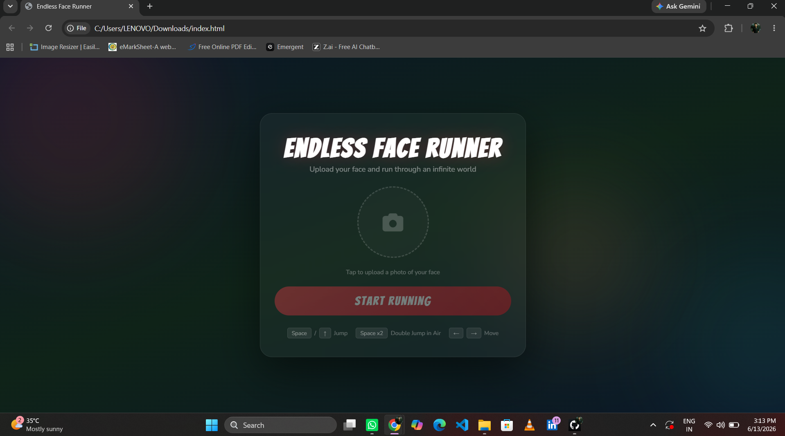
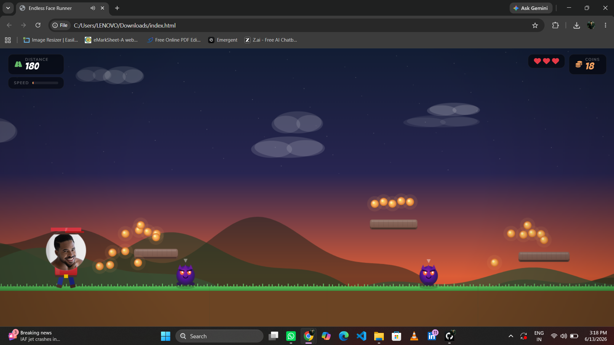
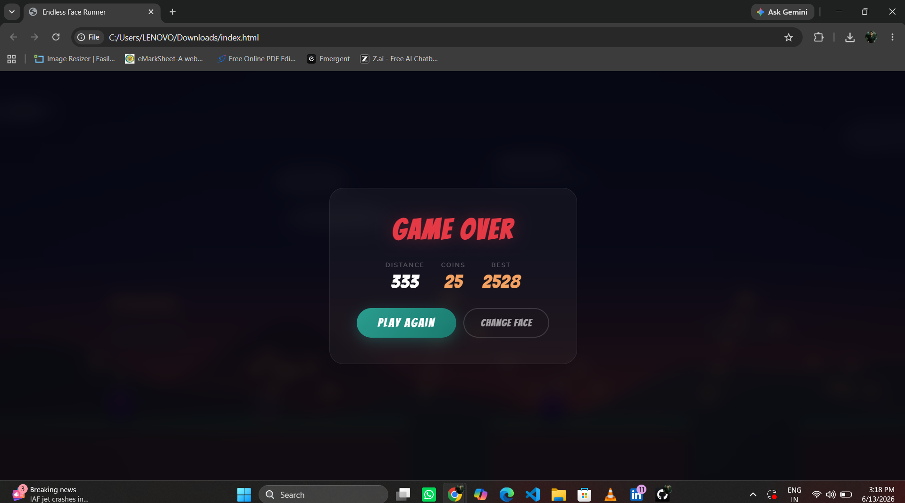

# 🎮 Endless Face Runner

A fun and fast-paced endless runner game built using **HTML, CSS, and JavaScript**. Control your character, jump across floating platforms, avoid deadly collisions, and survive for as long as possible while chasing a high score.

👉[Play Endless Face Runner](https://bhavesh23-27.github.io/Endless_Face_Runner/)

---
## ✨ Steps

1. Upload the image of your Character
2. Adjust thee Face within the margin
3. Click on Start Running
4. The Gameplay will start now
5. Score as High as you Can

---
## 🎮 Controls

| Key              | Action                     |
| ---------------- | -------------------------- |
| Space Bar        | Jump                       |
| Double Space Bar | Higher Jump                |
| Start Running    | Start the game             |
| Restart          | Play again after game over |

---

## 📸 Screenshots

### Main Menu

### Gameplay

### Game Over Screen

---

## 🛠️ Technologies Used

* HTML5
* CSS3
* JavaScript (Vanilla JS)

---

## 🎯 Objective

Guide the runner across floating platforms and survive as long as possible. Landing correctly on platforms keeps you alive, while touching them from the side or bottom results in a game over.

---

## 🔮 Future Improvements

* Sound effects and background music
* Mobile touch controls
* Power-ups and special abilities
* Global leaderboard
* Multiple characters and skins
* Difficulty progression

---

## 👨‍💻 Developer

Created by **Bhavesh Banait**

---

## ⭐ Support

If you enjoyed this project, please consider giving it a **Star ⭐** on GitHub.

---

## 📄 License

This project is available for educational and personal use.

